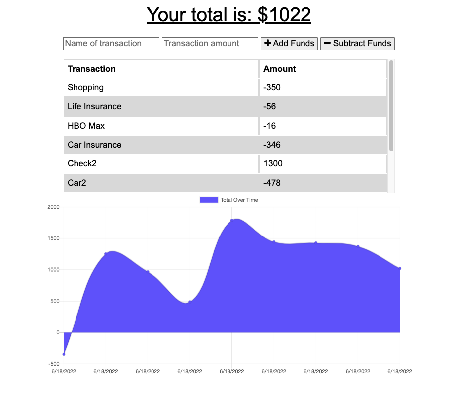

# PWA-BudgetTracker
  
  
  

  ## Description
  For this week's challenge, we were too add offline functionality to an already functioning Budget Tracker app. This was done by adding Indexed.db and Service Workers. I also utilized mongodb and express.js to help with this project.
  You can see a preview of the site below!
  

  ## Table of Contents
  - [Installation](#installation)
  - [Usage](#usage)
  - [Credits](#credits)
  - [Tests](#tests)
  - [Questions](#questions)
  - [License](#license)

  ## Installation
  Download this repo as a .zip file to your local machine and then open with VSCode. You'll need to run "npm init -y" as well as "npm i" in order to install all dependencies. Depending on your machine, you'll need to start the MongoDB server and then run "npm start" in order to start up the server on your localhost:3000. Then you'll be able to visit the site.

  ## Usage
  Budget Tracking

  ## Credits
  UTSA's Coding Bootcamp.

  ## Tests
  N/A

  ## Questions
  If you have any questions, feel free to [email me!](mailto:alycain.99@gmail.com)

  And checkout my GitHub: [pixiepucker!](https://github.com/pixiepucker)

  ## License
  
  This application is licensed by [MIT](https://opensource.org/licenses/MIT)